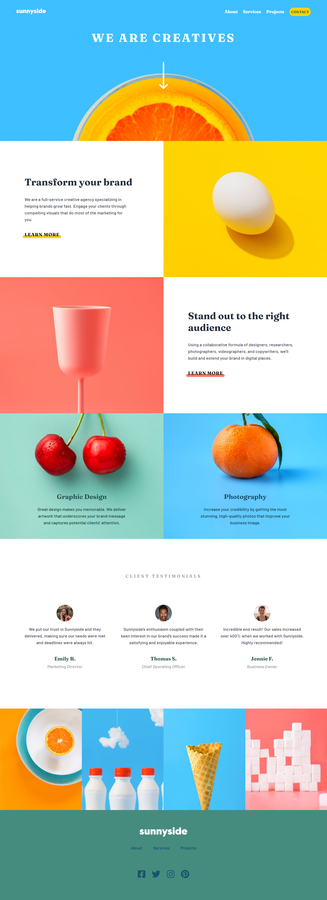
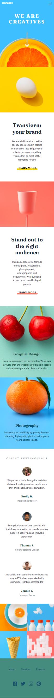

# Frontend Mentor - Sunnyside agency landing page solution

This is a solution to the [Sunnyside agency landing page challenge on Frontend Mentor](https://www.frontendmentor.io/challenges/sunnyside-agency-landing-page-7yVs3B6ef). Frontend Mentor challenges help you improve your coding skills by building realistic projects.

## Table of contents

- [Overview](#overview)
  - [The challenge](#the-challenge)
  - [Screenshot](#screenshot)
  - [Links](#links)
  - [Built with](#built-with)
  - [Author](#author)

### The challenge

Users should be able to:

- View the optimal layout for the site depending on their device's screen size
- See hover states for all interactive elements on the page

### Screenshot

### Links

- Solution URL: [Add solution URL here](https://github.com/hariscs/sunny)
- Live Site URL: [Add live site URL here](https://sunnyagency.netlify.app/)

### Built with

- Semantic HTML5 markup
- CSS custom properties
- Flexbox
- CSS Grid

## Author

- Website - [Haris Shah](https://hariss.netlify.app)
- Frontend Mentor - [@hariscs](https://www.frontendmentor.io/profile/hariscs)
- Twitter - [@\_haris_shah](https://www.twitter.com/_haris_shah)
